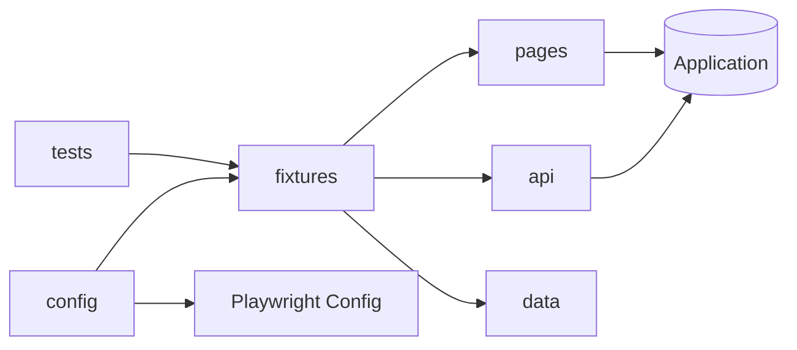

# Architecture

## Vision

This framework is a **business-flow-oriented** test automation system. Tests describe _what_ the product does; pages and API clients describe _how_ to interact with it.

## Layers

| Layer        | Responsibility            | Must not contain                |
| ------------ | ------------------------- | ------------------------------- |
| `tests/`     | Scenarios & assertions    | Selectors, HTTP details         |
| `pages/`     | UI interactions (POM)     | Assertions about business rules |
| `api/`       | HTTP clients, schemas     | Test orchestration              |
| `fixtures/`  | Dependency injection      | Business logic                  |
| `data/`      | Static & generated data   | UI/API calls                    |
| `utils/`     | Generic helpers           | Domain logic                    |
| `config/`    | Env, timeouts, Playwright | Test cases                      |
| `reporters/` | Artifacts & logging       | Test logic                      |
| `scripts/`   | CLI automation            | —                               |

## Data flow



## Fixture composition

Fixtures merge with `mergeTests` — no inheritance trees:

```ts
export const test = mergeTests(pagesTest, apiTest, usersTest);
```

Import `test` / `expect` only from `framework/fixtures/index.ts`.

## Scaling strategy

1. **By domain** — add folders under `tests/e2e/` (e.g. `checkout/`, `orders/`).
2. **By tag** — `@smoke`, `@regression`, `@api` for selective CI runs.
3. **By shard** — `playwright test --shard=1/4` for parallel CI jobs.
4. **By project** — separate Playwright projects per app or browser.

## Environment switching

Configuration loads from `.env` via `framework/config/env`. Switch targets:

```bash
ENV=stage BASE_URL=https://stage.example.com pnpm test
```

## Reporting

- HTML report (default Playwright)
- Allure (optional, `ENABLE_ALLURE=true`)
- Custom run/failure logs in `framework/reporters/logs/`

Failures capture screenshot, trace (on retry), and video automatically.
